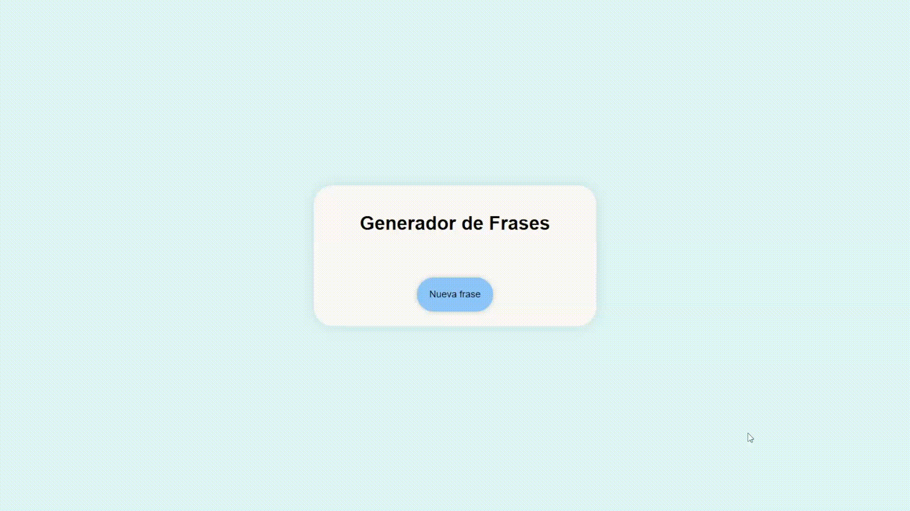

# Random Quote Generator

[](https://www.python.org/)
[](https://flask.palletsprojects.com/)
[](https://developer.mozilla.org/en-US/docs/Web/HTML)
[](https://developer.mozilla.org/en-US/docs/Web/CSS)
[](https://developer.mozilla.org/en-US/docs/Web/JavaScript)

<p>
  
</p>

## Descripción

Aplicación web que genera **frases aleatorias de éxito y sabiduría**.

* El backend está construido con **Flask**, sirviendo la página HTML y un endpoint `/frase-aleatoria`.
* El frontend utiliza **HTML, CSS y JavaScript** para mostrar las frases y permitir su actualización dinámica.
* Demuestra el consumo de APIs externas, manejo de **peticiones asíncronas** y manipulación del **DOM**.

---

## Estructura del proyecto

```
CONSUMODEAPIS/
│
├── app.py
├── README.md
├── .gitattributes
├── static/
│   ├── script.js
│   └── style.css
├── templates/
│   └── index.html
└── assets/
    └── demostracion.gif
```

---

## Flujo de funcionamiento

1. El usuario carga la página (`/`) y ve el botón “Nueva frase”.
2. Al hacer click, JS ejecuta `fetch("/frase-aleatoria")`.
3. Flask solicita frases a la API externa y selecciona una **aleatoria**.
4. JS recibe el JSON y actualiza los elementos `<p>` con la frase y el autor.
5. Si hay error, se muestra un mensaje alternativo en la página.

---

## Tecnologías usadas

* **Python 3.13.9** – backend.
* **Flask 3.1.3** – servidor ligero y rutas dinámicas.
* **HTML5 / CSS3 / JavaScript** – frontend sencillo, dinámico y estilizado.
* **API Ninja** – fuente de frases, en este caso filtradas por éxito y sabiduría.

---

## Características

* Peticiones asíncronas con `fetch`.
* Selección aleatoria de frases desde la API.
* Actualización dinámica del contenido sin recargar la página.
* CSS con flexbox para centrado vertical y horizontal.
* Transiciones suaves en el botón y contenedor (`hover`, `box-shadow`).
* Manejo básico de errores en frontend.

---

## Requisitos

- Python 3.13+
- pip
- Conexión a internet (para consumir la API externa)

---

## Instalación y ejecución

1. Clonar el repositorio:

```bash
git clone https://github.com/nomomaxoff/Generador-de-Frases.git
cd Generador-de-Frases
```

2. Instalar dependencias:

```bash
pip install flask requests
```

3. Ejecutar la aplicación:

```bash
python app.py
```

4. Abrir el navegador en:

```
http://127.0.0.1:5000/
```

5. Hacer click en el botón para generar frases aleatorias.

---

## Competencias demostradas

* Comprensión del funcionamiento de las **APIs** y su consumo desde el cliente.
* Uso de **peticiones asíncronas mediante fetch**.
* **Integración de datos dinámicos** en páginas HTML.
* Introducción a la **arquitectura cliente-servidor**.
* Primer contacto con **servidores de aplicaciones ligeros como Flask**.
* Capacidad para **documentar y explicar código de forma clara y estructurada**.
* Uso de **herramientas de control de versiones y repositorios remotos (GitHub)**.
